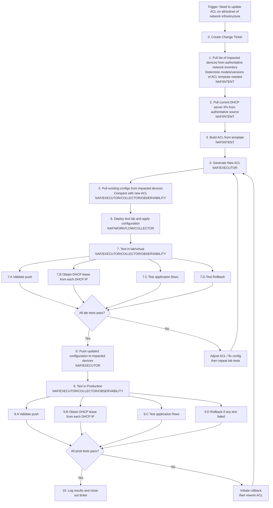

# Overview

### NAF Network Automation Framework in Action

## Use Case

ACL Maintenance and Updates

## Solution Summary

| Solution                     | Tools and Capabilities                                       | Notes                                                        |
| ---------------------------- | ------------------------------------------------------------ | ------------------------------------------------------------ |
| **Simple Code Solution**     | ITSM Change Managment System for Change Control - Service Now GitHub/GitLab/Other RC for local YAML IPAM files SuzieQ inventory and current state,  Containerlab Testing  Python scripts for execution and workflow ,  Jinja2 templating,  Netmiko/Nornir/Scrapli for SSH/NETCONF, | Best for teams with Python expertise; requires manual execution or cron scheduling; ideal for smaller environments or proof-of-concept implementations |
| **No Code Solution (Tines)** | ITSM Change Managment System for Change Control - Service Now Infrahub Device Inventory Infrahub IPAMS Containerlab Testing  Tines - Tines Stories with HTTP Request, Transform, Text Builder, Template tools, SSH Shell Command,  - User Input for approvals, Send to Email/Webhook, Loop/Conditionals, Event data storage | Visual workflow builder requires no coding; built-in audit trail and logging; approval gates for production changes; SOC 2 compliant automation platform |
| **CI/CD Pipeline**           | ITSM Change Managment System for Change Control - Service Now Infrahub Device Inventory Infrahub IPAMS Jenkins/GitHub Actions/GitLab CI Containerlab CLI integration, Automated gates | Full git-native workflow with version control for everything; automated testing gates prevent bad changes; scalable for large multi-team environments; requires infrastructure investment |

## Automation Solutions Comparison

| Step | Simple Code Solution | No Code Solution | CI/CD Pipeline | Other Alternatives |
|------|---------------------|------------------|----------------|-------------------|
| **Step 0** Create Change Ticket | Python script calling ServiceNow/ITSM REST API to create ticket | Tines workflow triggered by HTTP webhook or scheduled check; creates ServiceNow/Jira ticket via API Story | Ticket creation triggered by Git commit or webhook; automated ticket linking via pipeline orchestrator (Jenkins/GitHub Actions) | Ansible Tower/AWX workflow with survey; Rundeck job; n8n workflow automation Temporal Workflow |
| **Step 1** Pull impacted devices from inventory | Python + SuzieQ device inventory GitHub repo (YAML Inventory file under version control) | Tines HTTP Request to Infrahub GraphQL API; Transform tool parses JSON response; CSV export or direct pass to next Story | Pipeline stage queries Infrahub GraphQL API, outputs device list as artifact; inventory-as-code with Git-backed Infrahub | Ansible dynamic inventory plugin; NetBox scripts; Nautobot GraphQL API; custom webhook listeners |
| **Step 2** Pull DHCP server IPs from authoritative source | Python script reading local YAML file under Git revision control (IPAM data as code) | Tines HTTP Request to Infrahub GraphQL API; Regex/Transform tools extract IP addresses; data stored in Event for downstream use | Pipeline queries Infrahub GraphQL API during build; validates IPs against Infrahub source-of-truth | DNS lookup scripts; DHCP server API (Microsoft DHCP, ISC DHCP, Kea); SQL query to IPAM database; NetBox IPAM module |
| **Step 3** Build ACL from template | Jinja2 templating in Python with YAML/JSON variables | Tines Text Builder or Template tool with variable substitution; webhook-triggered form or API input provides variables | Template rendering stage in pipeline (Jinja2/Ansie); templates stored in Git with version control | Ansible `template` module; SaltStack pillars/grains; Terraform `templatefile` function; Go templates; Mustache.js |
| **Step 4** Generate New ACL | Python script rendering final ACL configs to files | Tines Template/Text Builder generates full ACL; Send to Email or Webhook for review; or Save to SharePoint/Google Drive | Pipeline artifact generation; linting and syntax validation as automated checks | Capirca/aclgen policy generation; Batfish configuration generation; Nornir config merging; custom DSL parsers |
| **Step 5** Pull existing configs & compare | Netmiko/Nornir/Scrapli to fetch configs; Python diff library (difflib) OR SuzieQ API | Tines SSH Shell Command to device (via proxy/bastion); Transform tool normalizes output; Text Builder compares with generated ACL | Automated config backup job; pipeline stage pulls golden configs; diff reported in PR/MR comments | Batfish config analysis; pyATS Diff; rancid/Oxidized config backup systems; SolarWinds NCM; Kentik config monitoring |
| **Step 6** Deploy to test lab | Python + Nornir/Netmiko to push config to Containerlab virtual devices | Tines SSH Shell Command pushes config to Containerlab devices; conditional logic validates command output before proceeding | Pipeline stage deploys to dynamically provisioned Containerlab environment; containerlab CLI integration with CI runner | EVE-NG with Ansible; GNS3 with Python API; VMware NSX-T lab; AWS/Azure virtual networks; CML (Cisco Modeling Labs) |
| **Step 7** Test in lab/virtual | Python pytest with Netmiko/paramiko for connectivity tests; Scapy for packet validation | Tines HTTP Request or SSH to run tests; Ping tool or external test runner webhook; Wait for Success condition before proceeding | Automated test stage in pipeline; pyats/robot framework tests; pytest with network fixtures; test results published | Batfish reachability analysis; pyATS test suites; ToDD distributed testing; Behave Gherkin tests; iperf3 bandwidth tests |
| **Step 8** Push to production devices | Python script with Nornir/Netmiko; batched deployment with error handling | Tines SSH Shell Command with approval gate (User Input or Send to Story); loop through device list with Transform/Lists; error catching with Trigger action | Canary deployment stage; blue-green rollout; automated push with rollback capability; deployment gated on lab tests | Ansible playbook with `serial` directive; SaltStack state orchestration; SuzieQ parallel SSH; rConfig for Cisco-centric deployments |
| **Step 9** Test in production | Python monitoring scripts; synthetic transaction tests; ICMP/HTTP probes | Tines HTTP Request or SSH to run show commands; Webhook to external monitoring tool; Wait tool with retry logic for validation | Smoke tests in pipeline post-deployment; automated health checks; synthetic monitoring validation; rollback on failure | ThousandEyes synthetic monitoring; Pingdom/New Relic checks; Nagios/Icinga service checks; Prometheus blackbox exporter |
| **Step 10** Log results and close ticket | Python API call to update ticket status, attach logs, add closure comments | Tines HTTP Request to update ServiceNow/Jira ticket; Attach Event data as comment; Change status to Closed/Resolved | Pipeline final stage updates ticket via API; attaches pipeline logs and test results; auto-closes on success | ElastiFlow for network observability logging; Slack/Teams webhook notifications; PagerDuty incident resolution; Excel API logging |

