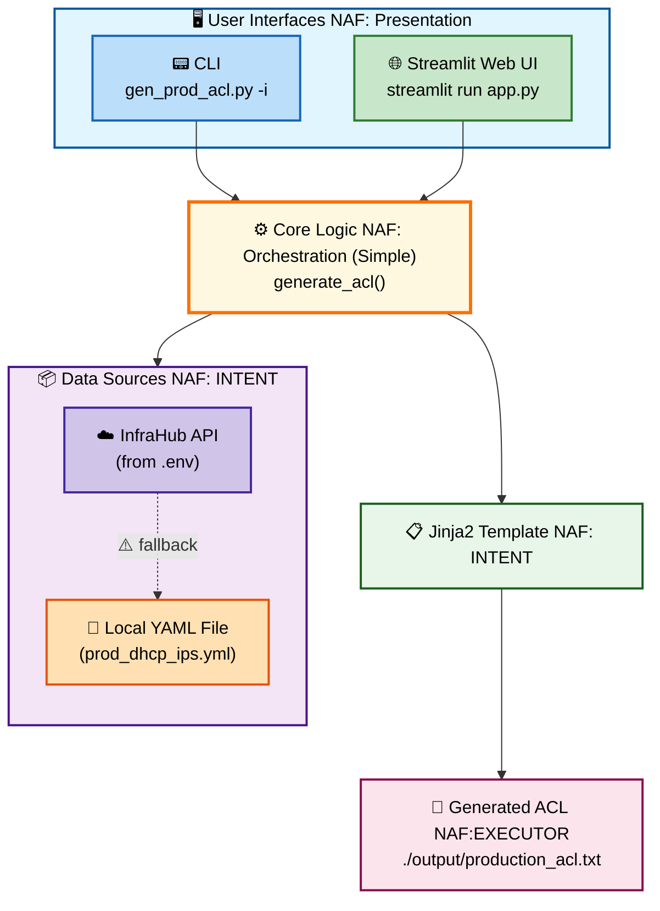

# ACL Automated Workflow

A Python-based workflow for generating, testing, and deploying Access Control List (ACL) configurations through a guided three-step process.

### NAF Network Automation Framework in Action


## Overview

This repository provides a dual-interface solution for automating ACL configuration management:

- **CLI Interface**: Command-line tool for scripting and automation (`gen_prod_acl.py`)
- **Web Interface**: Streamlit-based interactive UI (`app.py`)

Both interfaces share the same core logic and support automatic fallback from InfraHub API to local file when the API is unavailable.

## Architecture

### Current Implementation (Code-Based)



### Future Roadmap

| Version | Approach | Description |
|---------|----------|-------------|
| Simple - Code | Code-Based | Current implementation with CLI and Streamlit interfaces |
| Simple - No Code | No-Code | Workflow orchestration through visual/drag-and-drop interface |
| Advanced | CI/CD Pipeline | Fully automated execution integrated into deployment pipelines |


## Three-Step Workflow

### Step 1: Generate ACL
- **Source Selection**: Choose between InfraHub API or local YAML file (`prod_dhcp_ips.yml`)
- **Automatic Fallback**: If InfraHub fails (bad token, no connection), automatically falls back to local file
- **Template Rendering**: Uses Jinja2 template to generate ACL configuration
- **Compare to Production**: Get current ACL from impacted devices (are they all the same? how does the new version differ?)
- **Output**: Saves generated ACL to `./output/production_acl.txt`

### Step 2: Test on Digital Twin (Framework)
- Build "Digital Cousin"
- ACL syntax validation
- Configuration merge/replace simulation
- Traffic flow validation
- Policy compliance checks
- Rollback testing

### Step 3: Push & Test in Production (Framework)
- Pre-deployment snapshot and backup
- ACL push to devices
- Post-deployment validation
- Connectivity tests
- Monitoring period with rollback capability

## Quick Start

### Prerequisites

1. Install dependencies:
   ```bash
   uv sync
   # or: pip install -r requirements.txt
   ```

2. Configure environment variables:
   ```bash
   cp .env.example .env
   # Edit .env and add your INFRAHUB_TOKEN
   ```

### CLI Usage

```bash
# Use local file (default)
uv run gen_prod_acl.py

# Try InfraHub first (falls back to local file on any error)
uv run gen_prod_acl.py -i
```

### Streamlit Web Interface

```bash
uv run streamlit run app.py
```

Then open your browser to `http://localhost:8501`

## Configuration

### Environment Variables (`.env`)

```bash
INFRAHUB_URL=https://sandbox.infrahub.app/graphql
INFRAHUB_TOKEN=your_token_here
```

### Local IP Source (`prod_dhcp_ips.yml`)

```yaml
dns_ips:
  - 10.0.0.1/32
  - 10.0.0.2/32
  - 10.0.0.3/32
```

## File Structure

```
.
├── gen_prod_acl.py          # Core ACL generation logic + CLI entry point
├── app.py                   # Streamlit web interface
├── utilities.py             # InfraHub API client
├── prod_dhcp_ips.yml        # Local IP source (fallback)
├── templates/
│   └── production_acl.j2    # Jinja2 ACL template
├── output/                  # Generated ACL output directory
├── .env.example             # Environment variable template
├── pyproject.toml           # Python dependencies
└── README.md                # This file
```

## Key Features

- **Dual Interface**: Both CLI and web UI use the same core logic
- **Automatic Fallback**: InfraHub errors gracefully fall back to local file
- **Step Gating**: Workflow enforces completion order (Step 1 → Step 2 → Step 3)
- **Session Persistence**: Streamlit maintains state across interactions
- **Extensible Framework**: Steps 2 and 3 are ready for actual implementation

## Dependencies

- `jinja2` - Template rendering
- `pyyaml` - YAML file parsing
- `requests` - HTTP client for InfraHub API
- `streamlit` - Web interface framework
- `python-dotenv` - Environment variable management

## License

Copyright (c) 2023 EIA 
